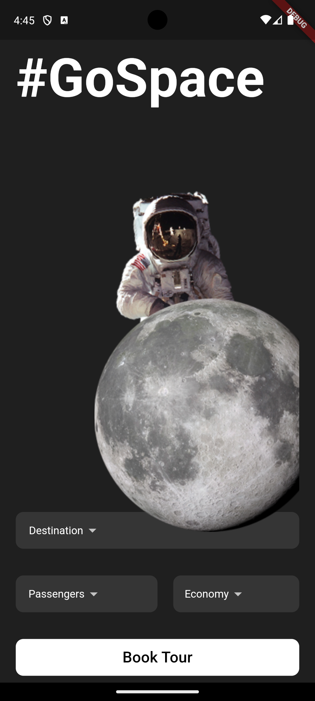
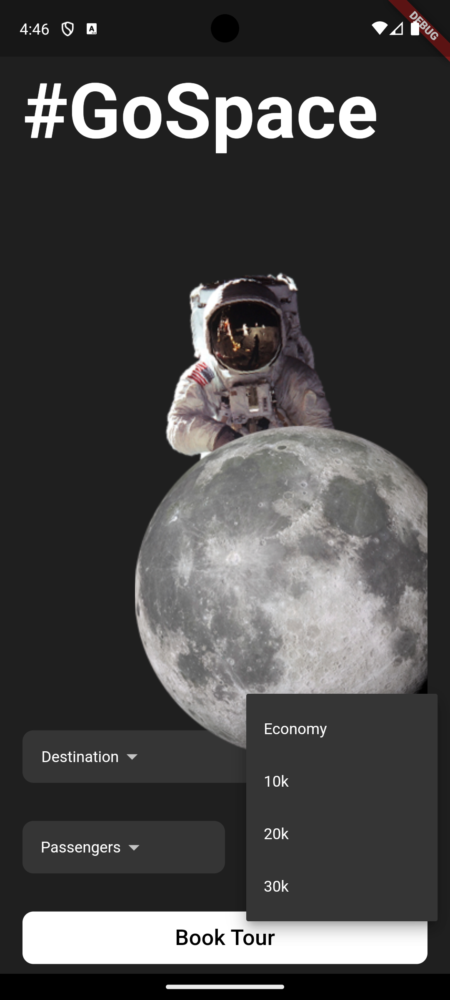
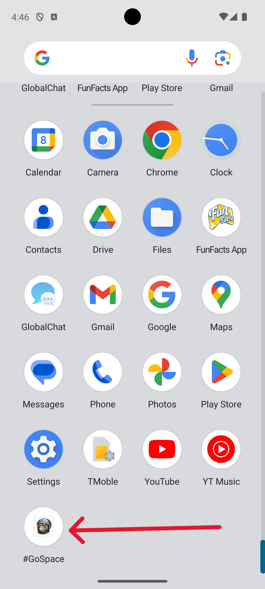

# GoSpace

🚀 **GoSpace** is a Flutter application designed to understand and experiment with UI design concepts. This project includes various UI elements and widgets to create an interactive and visually appealing mobile application.

## Features

- **📱 Custom App Icons**: Added custom icons for both Android and iOS platforms.
- **📏 Responsive Design**: Utilizes `MediaQuery` to adapt to different screen sizes.
- **🛡️ SafeArea Widget**: Ensures that the UI elements are displayed within the safe area of the screen.
- **🔽 Custom Dropdown Buttons**: Created reusable dropdown widgets with custom styling.
- **📚 Stack Widget**: Implemented stack widgets to overlay elements.
- **🔘 MaterialButton**: Added MaterialButton widgets for interactive elements.
- **🖼️ Image Widgets**: Included image widgets with custom positioning and alignment.

## Commit History Highlights

- **🆕 Add the android and ios app icons and the name of the app**: Custom icons and app name were added to enhance the app's branding.
- **📍 Make the position of the astro_moon image**: Positioned the astro_moon image using the Align widget.
- **🔍 Know how stacks work in Flutter UI**: Implemented stack widgets to understand their behavior in the UI.
- **➕ Add the new MaterialButton widget**: Added MaterialButton widgets to the bottom of the screen for user interaction.
- **📌 Positioning the dropdowns on the screen**: Positioned dropdown buttons and added more dropdown options.
- **🔄 Create a reusable widget for dropdown making**: Created reusable dropdown widgets for consistent styling and functionality.

## 📸 Screenshots





## 🚀 Getting Started

To get started with this project, follow these steps:

1. **Clone the repository**:
  ```sh
  git clone https://github.com/yourusername/gospace.git
  cd gospace
  ```

2. **Install dependencies**:
  ```sh
  flutter pub get
  ```

3. **Run the application**:
  ```sh
  flutter run
  ```

## 🤝 Contributing

If you would like to contribute to this project, please follow these steps:

1. Fork the repository.
2. Create a new branch (`git checkout -b feature/YourFeature`).
3. Make your changes and commit them (`git commit -m 'Add some feature'`).
4. Push to the branch (`git push origin feature/YourFeature`).
5. Open a pull request.

## 📜 License

This project is licensed under the MIT License - see the [LICENSE](LICENSE) file for details.

## 📧 Contact

For any questions or feedback, please reach out to [yasithabhanukac@gmail.com](mailto:yasithabhanukac@gmail.com).
